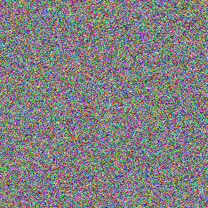

# Max entropy project

This repo is the result of a research idea I've tried in my master's degree:

I was inspired by Francis Crick's theory of [Sleep](https://www.nature.com/articles/304111a0) that sleep and REM sleep's function is for doing [Reverse learning](https://en.wikipedia.org/wiki/Reverse_learning) that is to remove parasitic connection that happened during wakeful learning.

My main insight for this project was to connect this idea with Jaynes's maximum entropy principle which states that the probability distribution which best represents the current state of knowledge about a system is the one with the largest entropy

 The idea is to do entropy regularization via a wake-sleep algorithm where during the wake phase the neural network is learning in the normal setting backpropagating the gradient of the loss of interest with real data, and during the sleep phase giving noise in the input and backpropagating the weights with respect to the softmax entropy.

According to Jaynes's maximum entropy principle and how we would like the neural network to behave none of the categories should be highly active or inactive when the model gets noise in input, doing so will naturally kill parasitic connections and regularize the network to a better set of weights without any additional data points.

 Unfortunately, I wasn't able to make this idea work but I might come back to it.

**Idea:**
                     
  

_**Left**_: Wake phase classical loss minimization with real data.

_**Right**_: Sleep phase entropy maximization with noise.

 
